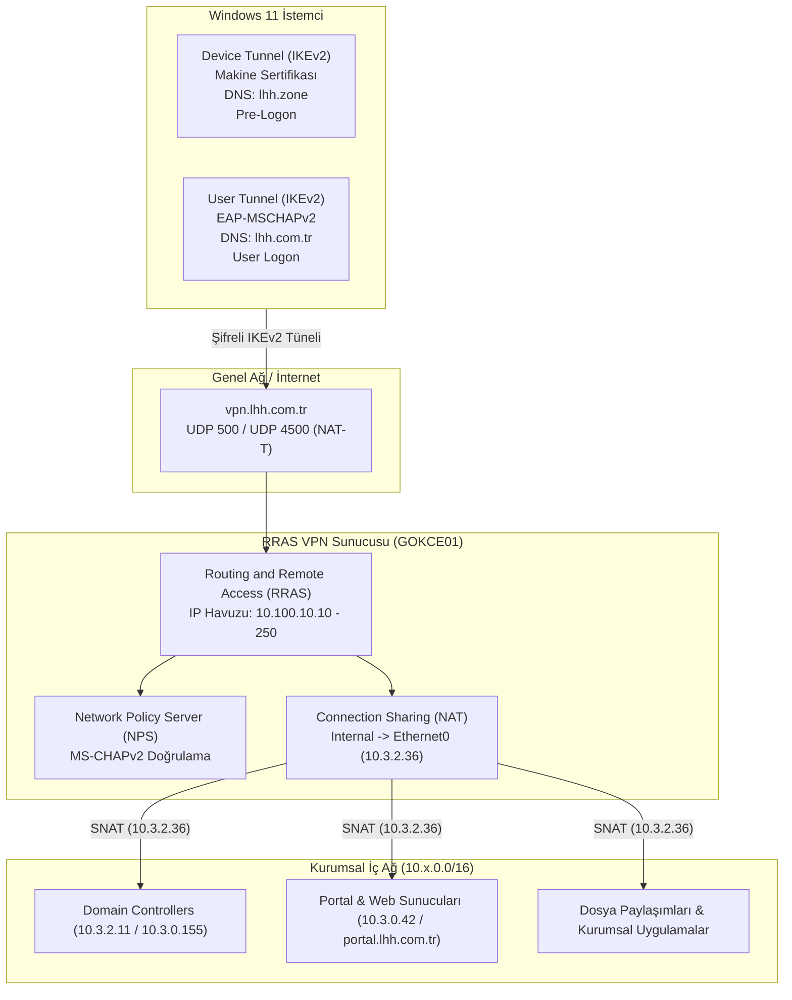

# Lokman Hekim Sağlık Grubu - Always On VPN (AOVPN) Altyapı ve Dağıtım Rehberi

Bu depo, Windows Server 2025 (RRAS + NPS) ve Windows 11 istemciler üzerinde çift tünelli (**Device Tunnel + User Tunnel**) Always On VPN mimarisini uçtan uca kurmak, güvenliğini sağlamak (Suite-B IPsec) ve otomatikleştirmek için kullanılan üretim ortamında doğrulanmış betikleri, şablonları ve operasyonel kılavuzları içerir.

---

## 🏛️ Mimari Genel Bakış



---

## 📁 Dizin Yapısı

```
C:\lokman-aovpn\
├── README.md                           # Kapsamlı mimari, kurulum ve sorun giderme kılavuzu
├── SKILL.md                            # Antigravity CLI yetenek tanımı ve operasyonel standartlar
├── .gitignore                          # Geçici dosyalar ve sertifika filtreleri
├── docs/
│   ├── SUNUCU_KURULUM_KILAVUZU.md       # Adım adım Windows Server (RRAS+NPS+NAT) kurulum kılavuzu
│   └── ISTEMCI_VE_SCCM_DAGITIM_KILAVUZU.md # Manuel istemci kurulumu ve SCCM Application dağıtım kılavuzu
├── examples/
│   ├── DeviceTunnel.xml                # Makine tüneli XSD uyumlu profil şablonu (Pre-logon)
│   └── UserTunnel.xml                  # Kullanıcı tüneli XSD uyumlu profil şablonu (EAP-MSCHAPv2)
└── scripts/
    ├── Deploy-AovpnProfiles.ps1        # WMI Bridge (MDM_VPNv2_01) üzerinden profil yükleme betiği
    ├── Fix-AovpnIpv6Bypass.ps1         # İstemci PBK, IPv6CP bypass, NAT-T ve IPsec Suite-B sertleştirme
    ├── Configure-RrasNat.ps1           # Sunucu tarafı RRAS Source-NAT (SNAT) kurulum betiği
    └── Install-AovpnMaster.ps1         # SCCM / Otomasyon için master kurulum wrapper betiği
```

---

## ⚙️ 1. Profil Türleri ve Karşılaştırma

| Parametre | LHH Device Tunnel (Cihaz Tüneli) | LHH User Tunnel (Kullanıcı Tüneli) |
| :--- | :--- | :--- |
| **Kapsam** | Sistem Geneli (`AllUserConnection = $true`) | Kullanıcı Bazlı (`AllUserConnection = $false`) |
| **PBK Konumu** | `C:\ProgramData\Microsoft\Network\Connections\Pbk\rasphone.pbk` | `%APPDATA%\Microsoft\Network\Connections\Pbk\rasphone.pbk` |
| **Çalışma Zamanı** | Windows açılışında, oturum öncesi (**Pre-Logon**) | Kullanıcı oturum açtığında (**User Logon**) |
| **Kimlik Doğrulama** | Machine Certificate (AD CS Kurumsal CA) | EAP-MSCHAPv2 (Type 26) / PEAP |
| **Kimlik Bilgisi** | Yerel Makine Sertifika Deposu (`LocalMachine\My`) | Windows Oturum Bilgisi (`UseWinlogonCredentials`) |
| **Erişim Kapsamı** | DC iletişimi, Kerberos, DNS, GPO, SCCM, CRL | Kurumsal web uygulamaları (`portal.lhh.com.tr`), dosya paylaşımları |
| **DNS Suffix** | `lhh.zone` | `lhh.com.tr` |

---

## 🔒 2. IPsec Suite-B Kriptografi Standardı

Her iki tünelin IKEv2 fazında RRAS sunucusuyla (`vpn.lhh.com.tr`) kararlı şekilde el sıkışabilmesi için profillere uygulanan kriptografi değerleri:

* **Authentication / Bütünlük:** `SHA256128` / `SHA256`
* **Şifreleme (Cipher / Encryption):** `AES256`
* **Diffie-Hellman Grubu (IKE Faz 1):** `Group14` (2048-bit)
* **PFS Grubu (IKE Faz 2 - Child SA):** `PFS2048` *(Sunucu tarafında zorunludur; `None` veya farklı grup seçildiğinde tünel düşer)*

İstemcide bu yapılandırmayı uygulamak için:
```powershell
Set-VpnConnectionIPsecConfiguration -ConnectionName "LHH User Tunnel" `
    -AuthenticationTransformConstants SHA256128 `
    -CipherTransformConstants AES256 `
    -DHGroup Group14 `
    -EncryptionMethod AES256 `
    -IntegrityCheckMethod SHA256 `
    -PfsGroup PFS2048 -Force
```

---

## 🌐 3. Sunucu Tarafı Source-NAT (SNAT / Connection Sharing)

### Problem (Asimetrik Yönlendirme)
VPN istemcileri `10.100.10.0/24` bloğundan IP aldığında, iç ağdaki web/portal sunucularına (`10.3.0.42`) giden istekler sunucuya ulaşır; ancak omurga güvenlik duvarında/router'ında `10.100.10.0/24 -> [RRAS_IP]` statik dönüş rotası bulunmadığında cevap paketleri istemciye dönemez ve bağlantı kopar (`TotalBytesOut` sıfıra yakın kalır).

### Çözüm (Otomasyon Betiği)
RRAS üzerinde Connection Sharing (NAT) protokolü etkinleştirilerek istemci trafiği sunucu LAN IP'si arkasında maskelenir:

```powershell
powershell -ExecutionPolicy Bypass -File "C:\lokman-aovpn\scripts\Configure-RrasNat.ps1" -LanInterfaceName "Ethernet0"
```

---

## 🚀 4. İstemci Kurulum ve Dağıtım Adımları

### Adım 1: Profili WMI Bridge Üzerinden Yükleme
```powershell
powershell -ExecutionPolicy Bypass -File "C:\lokman-aovpn\scripts\Deploy-AovpnProfiles.ps1" `
    -ProfileName "LHH-User-Tunnel" `
    -ProfileXmlPath "C:\lokman-aovpn\examples\UserTunnel.xml"
```

### Adım 2: Ağ ve Çevirici Sertleştirmesini Uygulama
Windows 11 24H2 Hata 628/623 sorunlarını gidermek ve Suite-B'yi zorlamak için:
```powershell
powershell -ExecutionPolicy Bypass -File "C:\lokman-aovpn\scripts\Fix-AovpnIpv6Bypass.ps1"
```

---

## 🛠️ 5. Karşılaşılan Hatalar ve Saha Çözümleri

### 1. WMI Bridge `MI RESULT 1` (Daha belirgin bir hata kodunun kapsamadığı genel hata)
* **Sebep:** Windows CSP XSD şema sırasının bozulması veya XML etiket adlarının yanlış olması.
* **Çözüm:** XSD sıralaması kesinlikle `<DnsSuffix>` -> `<RegisterDNS>` -> `<NativeProfile>` (içinde `<DisableClassBasedDefaultRoute>`) -> `<Route>` şeklinde olmalıdır.

### 2. Hata 628 (The connection was terminated by the remote computer)
* **Sebep:** İstemcinin IPv4-only RRAS sunucusuna IPv6CP çift yığın paketi göndermesi.
* **Çözüm:** PBK dosyalarında `IpVersion=1`, `Ipv6Assign=0` ve `ExcludedProtocols=0` zorlanması.

### 3. Traffic Selector Rotalarının Yansıması
* **Sebep:** Split-tunneling sırasında sunucunun gönderdiği rotaların istemci yönlendirme tablosuna eklenmemesi.
* **Çözüm:** PBK dosyasında `PlumbIKEv2TSAsRoutes=1` değerinin aktif edilmesi.

---

## 📊 6. Durum Kontrol ve Teşhis Komutları

```powershell
# 1. Sunucuda Aktif VPN Oturumları ve Trafik Durumu
Get-RemoteAccessConnectionStatisticsSummary

# 2. NPS Yetkilendirme Günlükleri (Security Log)
Get-WinEvent -FilterHashtable @{LogName='Security'; Id=6272,6273; StartTime=(Get-Date).AddHours(-1)} -MaxEvents 5

# 3. İstemcide Tünel Rotalarının Kontrolü
Get-NetRoute -InterfaceAlias "*Tunnel*" -AddressFamily IPv4 | Format-Table DestinationPrefix, NextHop, RouteMetric

# 4. Sunucuda NAT Arayüz Durumu
netsh routing ip nat show interface
```
